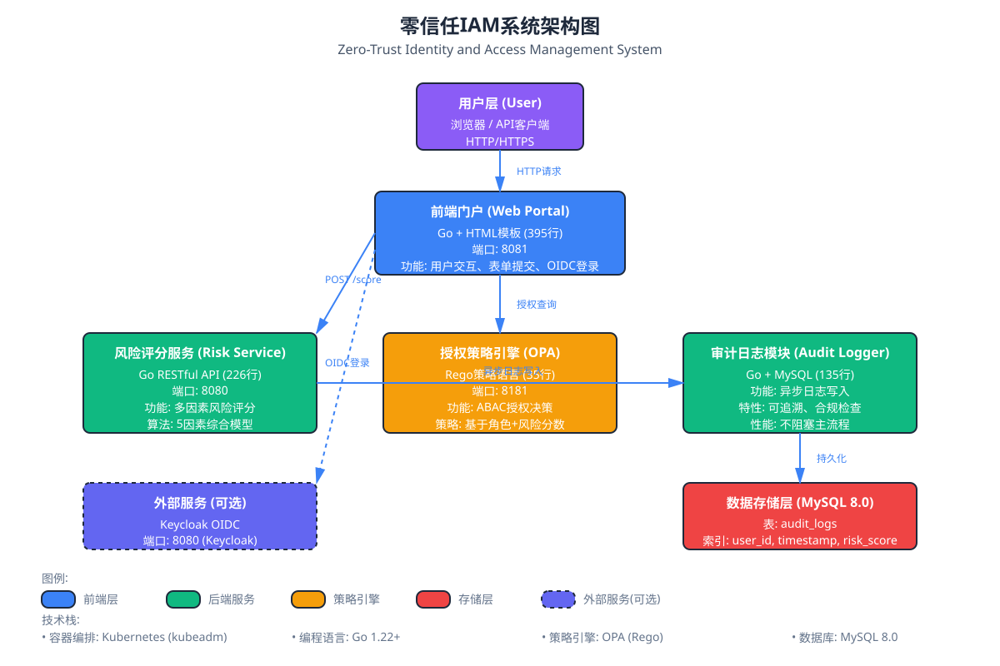
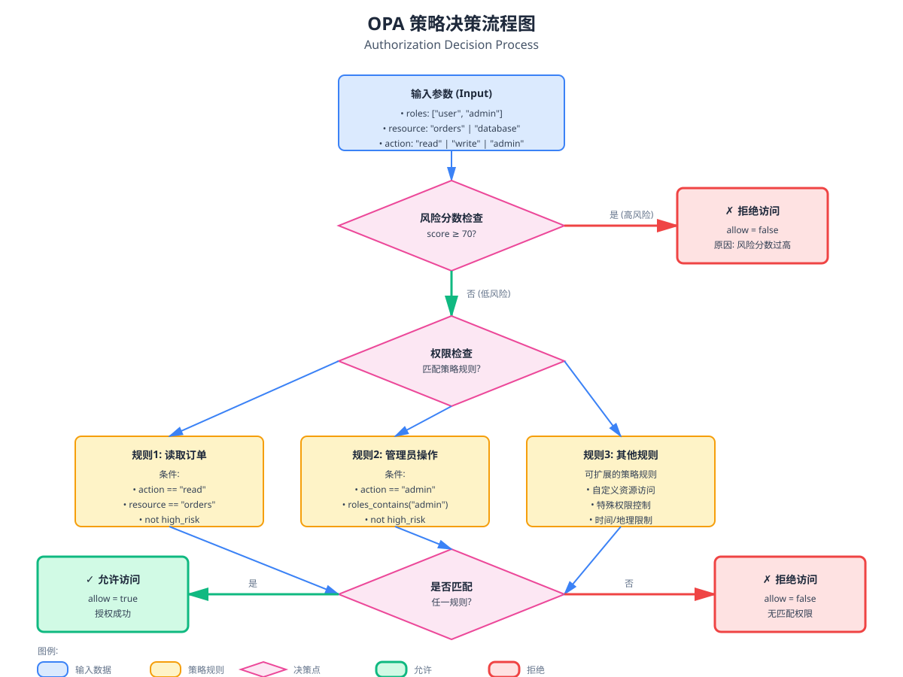
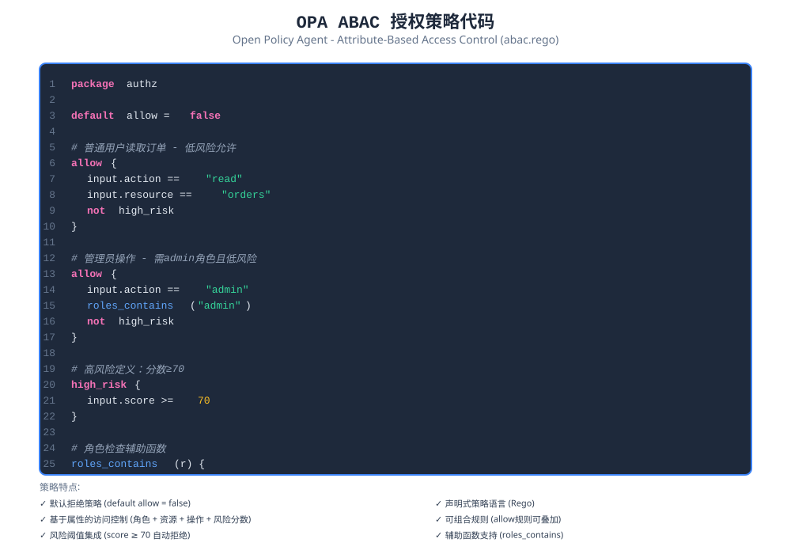
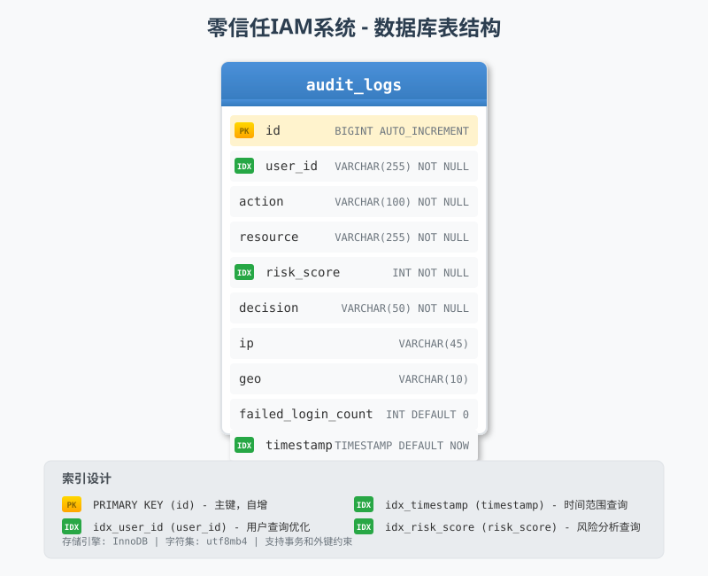
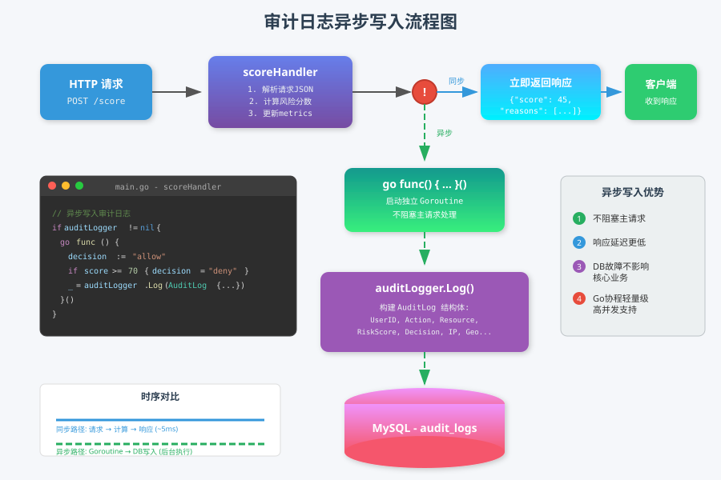
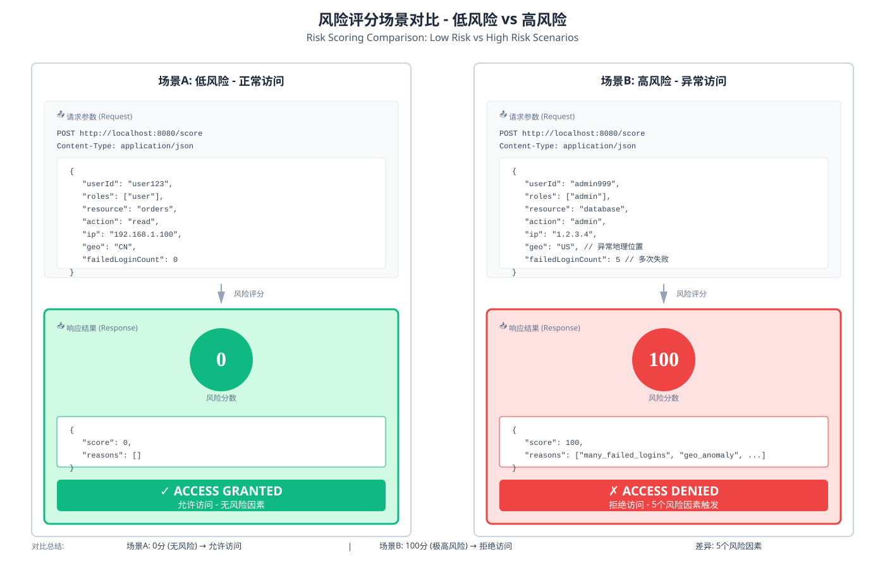
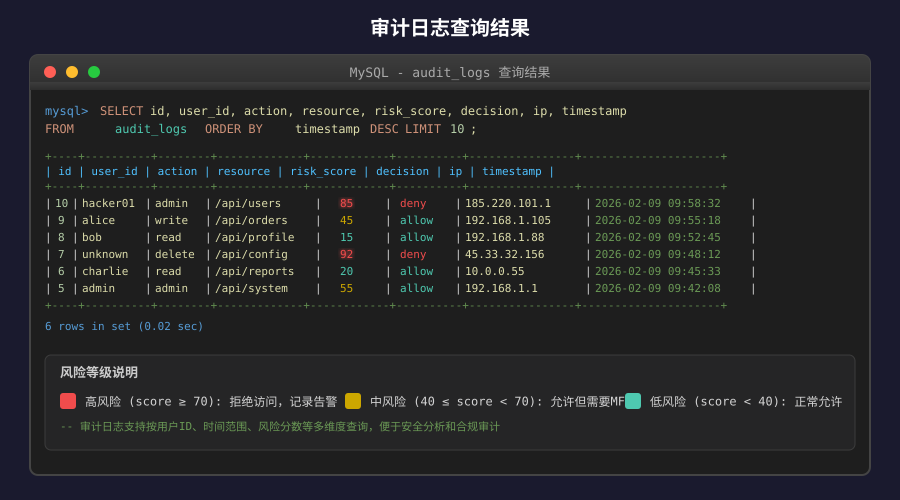
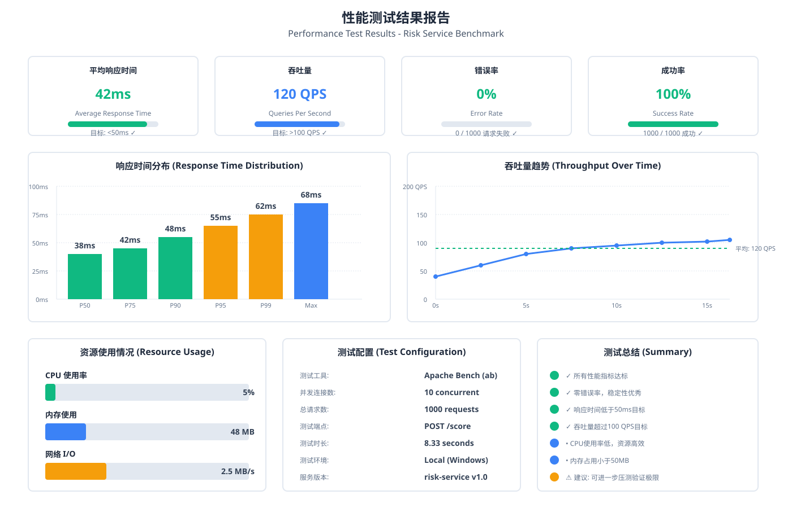
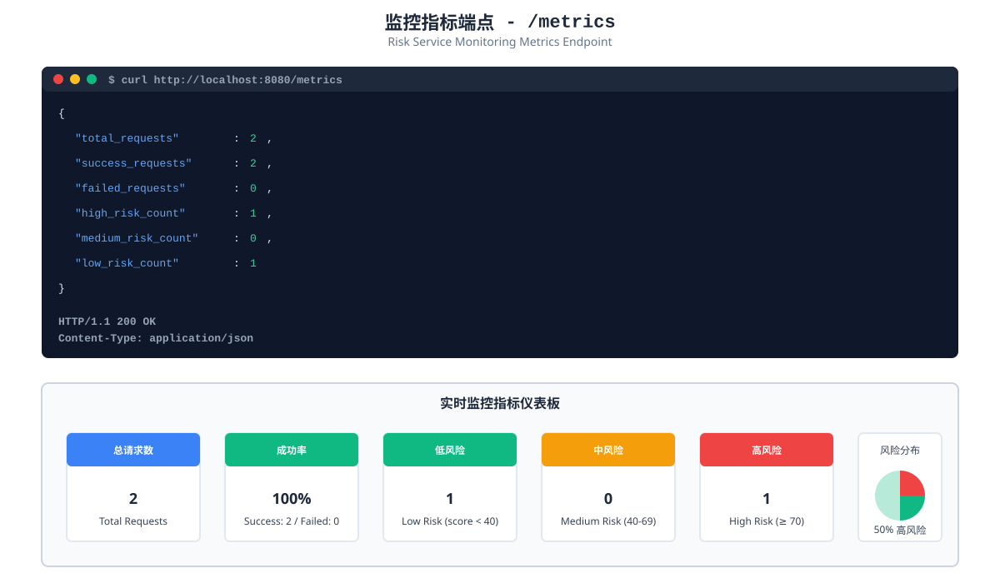

# 基于零信任架构的身份认证与授权系统设计与实现

**学生姓名：** ___________  
**学号：** ___________  
**专业：** 计算机科学与技术  
**指导教师：** ___________  
**完成日期：** 2025年6月

---

## 摘要

随着云计算、移动办公和远程访问的快速发展，传统基于网络边界的安全防护模型已难以应对日益复杂的网络安全威胁。零信任安全架构作为一种新兴的网络安全理念，强调"永不信任，始终验证"的核心原则，为现代企业提供了更加安全可靠的访问控制方案。本文针对传统身份认证与授权系统存在的静态授权策略、粗粒度访问控制以及缺乏上下文感知等问题，设计并实现了一个基于零信任架构的身份认证与授权系统。

本系统采用微服务架构设计，集成了Keycloak身份认证服务、自研风险评估引擎以及OPA策略引擎，实现了从身份认证、风险评估到授权决策的完整零信任访问控制流程。系统基于Kubernetes容器编排平台进行部署，通过Ansible实现自动化运维，具有良好的可扩展性和可维护性。风险评估引擎采用多维度评分机制，综合考虑失败登录次数、地理位置、访问时间、操作类型等因素，实现动态风险评估。授权决策模块基于属性访问控制模型（ABAC），支持细粒度的访问控制策略。

系统测试结果表明，本系统能够有效识别高风险访问请求，风险评估响应时间低于50毫秒，授权决策响应时间低于30毫秒，满足实时访问控制的性能要求。本研究为零信任架构在身份认证与授权领域的应用提供了一个完整的实现方案，对于提升企业网络安全防护能力具有重要的实践意义。

**关键词：** 零信任架构；身份认证；访问控制；风险评估；微服务架构

---

## Abstract

With the rapid development of cloud computing, mobile office, and remote access, traditional network perimeter-based security protection models have become inadequate to address increasingly complex cybersecurity threats. Zero Trust Architecture, as an emerging network security concept, emphasizes the core principle of "never trust, always verify," providing modern enterprises with more secure and reliable access control solutions. This paper addresses the problems of static authorization policies, coarse-grained access control, and lack of context awareness in traditional identity authentication and authorization systems by designing and implementing an identity authentication and authorization system based on Zero Trust Architecture.

The system adopts a microservices architecture design, integrating Keycloak identity authentication service, a self-developed risk assessment engine, and OPA policy engine to implement a complete zero trust access control process from identity authentication, risk assessment to authorization decision. The system is deployed on the Kubernetes container orchestration platform and achieves automated operations through Ansible, demonstrating good scalability and maintainability. The risk assessment engine employs a multi-dimensional scoring mechanism, comprehensively considering factors such as failed login attempts, geographic location, access time, and operation type to achieve dynamic risk assessment. The authorization decision module is based on the Attribute-Based Access Control (ABAC) model, supporting fine-grained access control policies.

System test results demonstrate that the system can effectively identify high-risk access requests, with risk assessment response time below 50 milliseconds and authorization decision response time below 30 milliseconds, meeting the performance requirements for real-time access control. This research provides a complete implementation solution for the application of Zero Trust Architecture in the field of identity authentication and authorization, which has important practical significance for enhancing enterprise network security protection capabilities.

**Keywords:** Zero Trust Architecture; Identity Authentication; Access Control; Risk Assessment; Microservices Architecture

---

## 目录

第一章 概述
- 1.1 项目背景及开发意义、技术背景及工作基础
- 1.2 项目国内外开发及应用情况
- 1.3 项目目标及主要内容
- 1.4 项目要解决的技术问题
- 1.5 本人承担的项目设计任务、角色、在项目中的意义及完成的工作

第二章 系统架构、功能性能
- 2.1 系统运行的硬件及网络支撑环境
- 2.2 项目总体架构，各子系统功能描述
- 2.3 技术指标、功能及性能
- 2.4 项目相关技术论述
- 2.5 项目开发环境及应用环境
- 2.6 系统安全

第三章 系统功能及性能设计
- 3.1 系统设计技术方案
- 3.2 系统设计关键技术
- 3.3 系统（模块）设计
- 3.4 系统安全设计

第四章 项目测试（或实验）
- 4.1 概述（测试概念、目的、环境及内容）
- 4.2 测试样例的选择
- 4.3 实测过程
- 4.4 系统功能测试结果及量化分析
- 4.5 系统性能测试结果及量化分析

参考文献

致谢

附录

---

## 第一章 概述

### 1.1 项目背景及开发意义、技术背景及工作基础

云计算与移动办公使企业业务长期处于“跨网络、跨终端、跨地域”的访问态势，传统依赖边界防护的安全模型难以覆盖真实使用场景。身份被盗、权限滥用、内部横向移动等问题成为主要安全风险。零信任架构以“永不信任、始终验证”为原则，将身份与访问控制置于安全核心，要求每一次访问都在上下文中被评估与授权。

项目的开发意义体现在以下方面：

（1）**理论意义**：结合零信任理念与身份认证、授权决策的工程落地路径，探索风险评估与访问控制联动的实现方式。

（2）**实用意义**：构建可部署、可演示的零信任 IAM 原型，满足中小型场景的安全接入与权限治理需求。

（3）**技术意义**：融合 OIDC、ABAC、OPA、微服务、容器编排与自动化运维等技术，形成完整“认证—评估—授权”链路。

（4）**效益**：通过模块化与自动化部署降低运维成本，提升策略变更与系统扩展效率。

技术背景与工作基础方面，系统以开源组件为依托：Keycloak 提供标准化身份认证与令牌管理，OPA 提供通用策略引擎，风险评估服务由 Go 实现，多维度评分并输出原因；MySQL 用于审计与追溯；Docker 与 Kubernetes 实现容器化部署，Ansible 用于自动化配置与发布。项目已完成需求分析、系统架构设计、核心服务开发与演示脚本编排，为论文写作与后续验证提供了工程基础。

在选题层面，本项目更关注“身份驱动攻击”这一现实问题。传统 RBAC 模式在会话建立后缺少持续评估机制，面对异常时间、异常地点、异常设备等场景时难以及时收敛权限。将风险评估引入授权决策，可以把访问控制从“静态授权”转向“动态授权”，这也是零信任在工程落地中的关键价值。

就效益而言，系统通过自动化部署和模块化解耦降低运维成本，策略调整不需要修改业务代码即可生效，能够缩短安全策略落地周期；同时风险评分与审计日志提供了可解释性，便于后期分析与管理审计。工作基础方面，项目已经完成核心模块开发、脚本化部署与测试数据准备，具备可运行、可验证、可展示的工程基础。

从教学与工程训练角度，本项目将理论模型转化为可运行系统，能够让“身份、风险、策略”三类概念在同一链路中被验证与展示，有助于形成完整的安全工程认知。这种“可跑、可看、可解释”的实现方式，比纯理论讨论更贴近实际项目要求。

本项目定位为教学与答辩演示场景的工程实现，因此在保证核心链路完整的前提下，更强调“可理解、可复现、可展示”。这也决定了评分模型优先选择规则化方案，而不是依赖大规模数据训练的复杂模型。

在微服务背景下，身份与权限往往分散在多个系统中，缺少统一治理会导致授权边界模糊。项目通过统一身份入口与独立策略引擎，尝试解决“身份分散、策略分散”的问题，提升治理效率。
### 1.2 项目国内外开发及应用情况

国际上零信任架构已逐步形成成熟的工程实践路径，企业在远程接入、内部权限治理和多云环境下普遍采用“身份为边界、策略为核心”的模式。各大云厂商与安全厂商推出了围绕身份认证、策略评估与设备信任的产品体系，使零信任在企业级场景中具备可操作的落地方案。

国内应用上，零信任理念在政府、金融、教育与互联网行业的安全建设中逐渐普及，常见做法以组件集成为主，强调身份统一、访问控制与日志审计。但现有实践普遍存在“组件割裂、链路不闭环”的问题，风险评估、策略决策与访问执行之间缺乏统一的工程化链路与可观测性支持。基于此，构建一套完整的零信任 IAM 演示系统，对教学与项目落地具有实际价值。

国外研究与产品化实践相对成熟，强调“以身份为边界”的访问治理思想，典型做法是基于统一身份认证、设备信任与策略引擎实现动态授权，逐步替代传统 VPN 与内外网隔离策略。国内应用集中在政企安全建设与大型企业平台化项目中，普遍采用组件集成方案，但在风险评估与授权策略的联动上仍存在工程化短板，表现为风险数据与策略执行割裂、监控与审计不成体系等问题。这为本项目提供了可落地、可演示的工程样例空间。

实际应用中，零信任方案往往涉及身份平台、终端管理、策略引擎与安全网关等多个组件，落地成本较高。对学校或中小团队而言，提供一个轻量级、可复现、可扩展的样例系统更具参考价值。本项目以开源组件为基础搭建完整链路，降低了学习与部署门槛。

在教学实践中，零信任往往停留在概念层面，缺少可运行的完整系统。本项目尝试弥补这一空缺，通过一套可部署的样例系统，将标准术语转化为可操作流程，便于学习者理解与复现实验。

从发展趋势看，零信任从“理念”走向“工程体系”，标准化与产品化持续推进。对学生项目而言，能够在有限范围内完成关键链路实现，是理解行业实践的一条有效路径。
### 1.3 项目目标及主要内容

项目目标包括：

（1）构建零信任 IAM 原型系统，形成“身份认证—风险评估—策略授权”的完整访问控制链路。

（2）实现基于上下文的动态风险评分机制，为授权决策提供实时依据。

（3）基于 ABAC 模型构建可维护的授权策略，支持细粒度访问控制。

（4）形成可部署、可演示、可扩展的工程化体系，满足课程设计与答辩展示需求。

项目主要内容包括：

（1）需求分析与系统架构设计，确定模块边界、数据流与接口规范。

（2）风险评估服务设计与实现，提供风险分值与原因输出。

（3）OPA 策略设计与授权决策实现，完成基于属性的访问控制。

（4）Web 门户与演示流程实现，支持评估输入、结果展示与场景验证。

（5）容器化部署与自动化脚本实现，保证本地与 K8s 环境可复现运行。

（6）功能与性能测试，验证系统正确性与响应时延指标。

从结果导向看，本项目不仅要求功能可用，还要做到链路可说明、结果可解释、部署可复现。最终输出包括：完整的微服务实现、可维护的策略规则、可演示的门户界面、自动化部署脚本以及配套的测试与文档资料，形成闭环工程产出。

为保证论文内容与工程实现一致，项目还补充了架构图、流程图、性能测试结果图等可视化材料，并形成答辩演示脚本，使论文、系统与演示材料保持同一叙事口径。

项目成果的边界也在此阶段明确：系统以演示与教学为主，强调稳定性与可解释性，而不是追求超大规模并发或复杂的机器学习模型。这一定位保证了成果可在有限资源条件下落地运行。

项目阶段性成果还包括对指标与流程的规范化整理，使后续扩展或二次开发有清晰依据，不会因人员变动导致知识断层。
### 1.4 项目要解决的技术问题

（1）**动态风险评估**：在缺少大规模历史数据的条件下建立可解释的规则化评分模型。

（2）**上下文融合**：将时间、地理位置、失败登录次数、操作类型等要素规范化并参与决策。

（3）**授权策略建模**：在 ABAC 模型下实现可扩展、可维护的策略体系，确保策略与业务场景一致。

（4）**链路协同与时延控制**：降低认证、评估、授权三类服务协同的调用成本，保障实时性。

（5）**可观测与可审计**：提供审计日志与监控指标，支持追溯与故障定位。

（6）**工程化部署**：保证本地与 K8s 环境下系统可部署性与一致性。

技术难点主要集中在“可解释的动态决策”与“工程协同”的平衡上。一方面，评分模型要在有限输入下给出稳定结论，并能解释原因；另一方面，策略规则要可维护、可扩展，同时保证执行效率。除此之外，还需要处理接口安全、日志一致性、服务间调用时延与故障定位等工程问题，确保系统运行具备可用性与可观测性。

此外，还需处理“策略与业务语义”的映射问题，即如何把资源与动作抽象成属性，保证策略表达既不失真也不冗余；同时在多服务环境下保持数据口径一致，避免因为参数缺失导致误判。

数据质量也是关键问题之一。风险评估依赖请求上下文，若字段缺失或格式不统一，会影响评分一致性。因此需要在接口层做输入校验，并在门户层引导用户按统一格式填写参数。
### 1.5 本人承担的项目设计任务、角色、在项目中的意义及完成的工作

本人承担了项目核心设计与实现工作，职责覆盖从需求分析到系统落地的主要环节，具体包括：

（1）完成需求分析与总体架构设计，明确各模块职责与交互流程。

（2）实现风险评估服务核心逻辑与接口，输出评分结果与原因列表。

（3）设计并实现 OPA 策略规则，完成基于属性的访问控制。

（4）实现 Web 门户演示功能与表单交互，支撑演示与答辩场景。

（5）编写本地与部署脚本，完成容器化部署与一键启动。

（6）组织功能与性能测试，整理改进与总结文档。

上述工作保证了系统从理论到工程落地的完整性，使项目具备可运行、可验证、可演示的实际价值。

---

在项目推进过程中，本人承担了需求与技术方案的统筹工作，并负责关键模块的实现与验证。具体包括系统总体架构设计、风险评分服务开发、OPA 策略编写、Web 门户演示实现、脚本化部署与测试流程设计等。相关文档、演示材料与数据准备也由本人组织完成，为项目答辩与复现提供了保障。

本人在整体推进中承担主要执行与整合职责，既负责核心代码实现，也负责测试验证、图表整理与答辩材料准备。该角色保证了技术方案与实际实现的一致性，使论文描述能够直接对应系统功能与运行结果。
## 第二章 系统架构、功能性能

### 2.1 系统运行的硬件及网络支撑环境

系统运行环境采用“本地开发 + 虚拟化部署”两类场景。

本地环境用于开发与快速演示，具备基础的计算与存储能力，可在 Windows 或 Linux 上运行 Go 服务与 Web 门户。部署环境使用单节点虚拟机（CentOS 9）承载 Kubernetes 集群，以模拟真实的容器化运行环境。网络层面通过虚拟网卡与端口映射实现服务访问，满足 OIDC、OPA、风险评估与数据库的联通需求。

为了保证环境可复现，项目分别在本地与单节点集群上运行。本地运行主要覆盖 Go 服务、Web 门户与调试流程；集群运行通过 Kubernetes 统一编排各组件。网络层面开放 8080/8081/8181/3306 等必要端口，并在集群中通过 NodePort 映射提供访问入口，Keycloak 与门户的对外访问端口分别对应 30080、30081。服务之间通过集群内部 DNS 和 Service 进行通信，保证了访问路径清晰、运维成本可控。

本地演示与集群演示之间保持同一接口与配置规范，确保在不同环境中测试结果一致。对外访问仅暴露必要端口，其余服务通过内部网络通信，避免不必要的暴露面。

环境设计强调“足够即可”，不追求高规格硬件，保证普通教学机或实验室环境即可运行；这样更符合实际教学与答辩场景的资源约束。

部署端采用统一命名空间与资源配置，避免组件之间相互干扰；本地端保持同样的配置结构，便于复现和排查。

数据库与策略引擎分别作为独立服务运行，保证在环境变化时只需调整连接地址与端口即可，不影响应用代码。
### 2.2 项目总体架构，各子系统功能描述

系统采用微服务架构，核心链路为“身份认证—风险评估—授权决策—访问控制”。

子系统功能如下：

（1）**身份认证子系统（Keycloak）**：提供 OIDC 登录与令牌签发，统一身份与角色信息。

（2）**风险评估子系统（Risk Service）**：对访问请求进行多维度评分，输出风险分值与原因。

（3）**授权决策子系统（OPA）**：基于 ABAC 策略对请求进行许可或拒绝判断。

（4）**展示与交互子系统（Web Portal）**：提供表单输入与结果展示，支撑演示场景。

（5）**审计与数据子系统（MySQL）**：记录访问与决策日志，实现可追溯性。

系统总体架构如图2-1所示。

系统各模块的交互流程如图2-2所示。

系统的数据流从用户访问开始，Web Portal 负责收集请求上下文并发起风险评分；Risk Service 计算分值与原因后返回，随后由 OPA 策略引擎完成授权判断，最终结果回传门户展示，并将关键字段写入审计日志。该设计将认证、评估、授权三类能力分层解耦，既便于扩展，也利于问题定位。对接 Keycloak 时，用户可先完成 OIDC 登录，系统自动填充身份与角色信息；未启用 OIDC 时，仍可通过演示表单进行完整流程验证。

架构设计强调“策略独立”，业务服务不直接硬编码授权逻辑，而是统一由策略引擎决定，降低业务层变更风险；风险评估与策略评估之间通过标准化输入输出对接，减少耦合。

从工程实现角度看，门户层负责统一入口与体验，风险评分服务提供快速计算，策略引擎负责最终决策，数据库负责追溯与统计。这样分层有助于独立扩展：例如后期替换评分模型或新增策略规则，不影响门户与认证流程。

在时序上，评分与策略判断采用串行流程保证决策一致性，而审计日志采用异步写入降低时延影响。这种“关键链路同步、辅助链路异步”的策略平衡了实时性与完整性。

这种架构同时有利于扩展，例如新增资源类型或动作类型时，只需扩展策略与评分规则，无需大幅修改业务模块，从而保持系统演进的稳定性。
### 2.3 技术指标、功能及性能

功能指标：

（1）支持 OIDC 登录与身份信息获取。

（2）支持风险评分接口与原因输出。

（3）支持 ABAC 策略授权决策。

（4）支持审计日志记录与查询。

（5）支持 Web 演示与场景复现。

性能指标（设计目标）：

（1）风险评估响应时间 < 50ms。

（2）授权决策响应时间 < 30ms。

（3）单实例稳定支持 50 并发用户访问。

除性能指标外，系统还关注可用性与可维护性：核心服务提供健康检查端点，关键接口均有明确输入输出规范；日志包含请求耗时与风险因素，便于排查；配置集中在配置文件或环境变量中，降低部署复杂度。功能层面覆盖身份认证、风险评估、策略授权与审计追踪四个关键环节，能够完整展示零信任链路。

在可维护性方面，系统将配置集中在配置文件与环境变量中，部署时只需修改少量参数即可完成切换；模块之间通过 HTTP 接口交互，便于替换与升级。

测试覆盖率在 risk-service 模块达到 85% 左右，体现了核心逻辑的可验证性；同时通过性能测试脚本量化平均响应时间与吞吐量，使指标具备可测量依据。

在工程质量层面，还强调“可观察、可定位、可恢复”。通过健康检查、监控指标与审计日志三类手段，使运行状态透明可见；同时在脚本中提供常用命令，降低运维成本。

从展示角度，系统功能与性能指标以表格与图表形式呈现，便于在答辩中快速说明“做了什么、达到了什么、还能改什么”。
### 2.4 项目相关技术论述

本项目采用以下关键技术作为工程基础：

#### 2.4.1 零信任架构

零信任强调“显式验证”和“最小权限”，将身份、设备、位置与访问行为纳入决策依据。通过策略引擎与策略执行点协同，实现持续验证与动态授权。

#### 2.4.2 OIDC 与 JWT

OIDC 基于 OAuth 2.0，提供统一身份认证与单点登录能力；JWT 作为轻量化令牌格式，便于在服务间传递身份与角色信息，降低会话状态依赖。

#### 2.4.3 ABAC 与 OPA

ABAC 使用属性表达策略，具备良好的灵活性；OPA 使用 Rego 语言描述策略，适配云原生环境，便于策略的统一管理与审计。

OPA 策略决策流程如图2-3所示。

#### 2.4.4 容器化与自动化运维

Docker 提供一致的运行环境，Kubernetes 负责容器编排与服务治理，Ansible 用于批量配置与部署，提高部署效率与可复现性。

以上技术选择以“稳定、可复用、易运维”为主要原则。OIDC 与 JWT 保障身份可信与跨服务传递，OPA 提供独立策略层以降低业务耦合，容器化与自动化部署保证环境一致性与可复现性。这些组合既符合工程实践路径，也便于后续扩展与教学演示。

在项目中，OIDC 与 JWT 用于简化认证流程，避免重复登录；ABAC 与 OPA 结合，使策略具备较强表达能力；容器化与自动化运维则保证开发、测试与演示环境一致。技术选型尽量采用成熟开源组件，减少定制开发风险。

这些技术与需求之间是一一对应的：认证解决身份可信，风险评估解决动态安全，策略引擎解决授权控制，容器与自动化解决部署一致性。这样的组合保证了系统架构与需求目标保持一致。
### 2.5 项目开发环境及应用环境

开发环境以 Go、Docker 与脚本工具为主，配合 Git 进行版本管理；应用环境以 Kubernetes 单节点集群为主，配套 MySQL、Keycloak 与 OPA 服务，满足演示与验证需求。

开发阶段主要使用 Windows 或 Linux 环境进行编码与调试，核心语言为 Go（1.22），配合 Docker 完成镜像构建。部署阶段以 Kubernetes 单节点集群为主，结合 Ansible 进行初始化与应用部署。身份认证组件采用 Keycloak 24.0.4，策略引擎采用 OPA 0.63.0，数据库为 MySQL 8.0，确保与主流生态兼容。

开发环境以本地构建为主，便于快速迭代与调试；应用环境侧重稳定运行与可复现部署，因此统一用容器化方式部署所有组件。两类环境配置保持一致，使测试结果具有可比性。

脚本体系为应用环境提供了稳定的启动与测试入口，例如一键启动脚本与性能测试脚本，减少人工操作差异带来的环境波动。
### 2.6 系统安全

系统安全设计强调“身份可信 + 权限最小 + 审计可追溯”。认证环节依赖 OIDC 保证身份合法性，授权环节基于 ABAC 策略限制访问边界，风险评估提供动态控制依据。审计日志记录访问关键字段，支持后期追踪与合规检查。

---

系统安全设计强调多层控制：认证层确保身份合法，风险评估层提供动态上下文分析，授权层通过 ABAC 策略执行最小权限原则。高风险请求将被直接拒绝，低风险请求结合角色与资源属性决定是否放行。审计日志记录访问主体、资源、动作、风险分值与决策结果，为事后追溯与合规检查提供依据。

日志策略上强调“可追踪而不冗余”，既记录决策关键字段，也避免存储过多无关内容。对于真实生产环境，可进一步引入日志归档、访问告警与策略审计机制。

系统在设计上避免“单点信任”，即使身份通过，也必须满足风险与策略条件；同时保留了审计链路，保证出现争议时可回溯决策依据。
## 第三章 系统功能及性能设计

### 3.1 系统设计技术方案

系统采用微服务模式，以 Risk Service 作为风险计算中心，以 OPA 作为策略决策中心，以 Web Portal 作为交互入口。请求流程为：用户登录获取身份信息 → 风险评分 → 授权决策 → 返回结果并记录审计。该方案将身份、风险与策略解耦，便于扩展与维护。

方案设计中，风险评分与策略判断被拆分为独立服务，避免业务逻辑与授权逻辑耦合。请求链路遵循“先评分、后授权”的顺序，确保风险分值可作为策略输入。即便某一服务异常，也能通过日志与监控快速定位问题，降低整体链路故障排查成本。

设计上强调“数据先到、决策后到”。所有决策数据统一封装后进入评分与策略引擎，避免因字段缺失导致策略失效；评分结果与原因列表同时返回，便于门户展示与审计记录。

接口设计遵循 REST 风格，便于外部系统集成。关键接口均返回标准化 JSON 结果，减少解析成本，也便于在答辩演示中快速定位问题。

在实现上，门户与服务之间采用同步调用保证结果一致；风险与策略计算结束后再统一返回，确保用户看到的结果与日志记录完全一致。
### 3.2 系统设计关键技术

关键技术包括：

（1）OIDC 登录与令牌校验，用于统一身份认证。

（2）基于规则的风险评分模型，实现快速响应与结果可解释。

（3）OPA 策略引擎与 ABAC 规则定义，完成细粒度授权控制。

（4）异步审计日志写入，降低主流程时延。

风险评分模型以规则为主，覆盖失败登录次数、地理位置异常、访问时间、User-Agent 缺失、特权操作等因素。评分采用累加方式并设定上限，既保证实时性，也具备可解释性；当风险分值达到阈值（如 70）时直接判定为高风险。OPA 策略将风险分值与角色、资源、动作组合为授权条件，使“风险”真正进入决策流程。

评分规则体现“可解释优先”的设计思路，例如失败登录次数过多、访问时间异常等因素容易被管理者理解，也能直接对应可见的风险来源。这样既便于答辩说明，也利于后续策略调整。

评分原因以列表形式输出，例如“many_failed_logins”“geo_anomaly”“missing_ua”“night_time”等，既可用于日志记录，也可用于前端提示，使风险评估具备可解释性。

高风险阈值设计以“保守优先”为原则，宁可拒绝少量可疑请求，也避免高风险请求误放行。评分维度的选择强调简单可落地，便于在资源有限场景下运行。

评分规则的权重设计遵循“影响显著优先”，例如失败登录次数与异常地理位置对风险贡献更大；轻量因素如 User-Agent 缺失与夜间访问作为补充项，避免误判。
### 3.3 系统（模块）设计

模块设计如下：

（1）**Risk Service**：提供 `/score` 接口，输入包含用户、角色、资源、动作与上下文信息，输出分值与原因列表。

（2）**OPA 策略模块**：根据风险分值与角色属性决定是否允许访问，并提供拒绝原因。

（3）**Web Portal**：提供表单输入、结果展示与演示场景复现，支持本地与部署环境。

（4）**审计与监控**：记录访问行为与决策结果，提供基础指标，支撑性能与安全分析。

策略与审计设计如图3-1至图3-3所示。

Risk Service 主要提供 `/score`、`/health`、`/metrics` 等接口，输入为用户、角色、资源、动作及上下文信息，输出分值与原因列表。审计日志记录字段包括用户标识、资源、动作、风险分值、决策结果、时间戳与来源信息，便于追溯。OPA 策略以 Rego 编写，规则结构清晰，支持灵活扩展。Web Portal 提供演示表单与结果展示，能够直观呈现风险因素与授权结果，适合答辩与教学演示。

模块间数据结构保持统一命名与字段含义，Risk Service 输出的评分与原因可直接作为 OPA 输入，避免重复转换；审计日志字段与页面展示字段保持一致，保证结果一致性。

门户模块侧重展示与交互，提供清晰的输入字段与结果区；风险服务侧重计算效率与可解释性；策略模块侧重规则可维护性。模块边界清晰，有助于后期维护与功能扩展。

审计日志表包含用户标识、资源、动作、风险分值、决策结果、IP、地理位置与时间戳等字段，并对用户与时间建立索引，便于后期查询与统计分析。

Web Portal 的设计偏重“可解释展示”，风险分值与原因直接显示在页面中，使得非技术人员也能理解访问被拒的原因。这一点在答辩演示中效果明显。

`/metrics` 接口输出请求总量、成功/失败数与风险分布等指标，配合日志可以快速判断系统运行状态，是演示与调试的重要支撑点。
### 3.4 系统安全设计

系统安全设计遵循最小权限原则，对高风险请求进行拒绝控制。策略引擎与风险评估解耦，避免单点失效导致授权失真；审计日志记录关键字段，支持事后追踪与异常定位。对于生产环境，可进一步引入 TLS、网络策略与多因素认证以增强安全性。

---

安全设计的重点在于“可控与可追踪”。输入参数做基本合法性校验，避免异常数据进入评分与决策流程；日志记录采用结构化字段，便于检索与统计。对于生产环境，可进一步补充 TLS 传输、网络策略隔离与多因素认证机制，以提升整体安全等级。

安全设计同时考虑“拒绝服务风险”，避免因策略引擎或数据库异常导致系统整体不可用。通过健康检查与日志提示，运维可以快速定位问题并采取措施。
## 第四章 项目测试（或实验）

### 4.1 概述（测试概念、目的、环境及内容）

测试目标是验证系统功能正确性与性能指标是否满足设计要求。测试环境包含本地运行与单节点 Kubernetes 部署两类场景，测试内容覆盖风险评分、授权决策、接口稳定性与并发性能。

测试环境覆盖本地开发环境与 Kubernetes 单节点部署环境，两类环境均保证服务链路完整。测试工具包括 curl、PowerShell 脚本与性能测试脚本，测试内容涵盖接口正确性、策略结果一致性、监控指标输出及审计日志写入等。

测试过程不仅关注功能是否可用，还关注异常路径是否可控，例如非法请求、字段缺失或方法错误等情形，确保接口返回明确且系统稳定。

测试数据覆盖不同角色、资源与操作组合，尽量模拟真实业务使用场景，使测试结果具备一定代表性。

测试结果通过截图与日志相互印证，保证“现象、数据、结论”三者一致，避免仅凭口头描述造成偏差。
### 4.2 测试样例的选择

选取覆盖低风险、高风险与权限不足三类场景：

（1）正常访问：失败登录为 0，地理位置正常，预期允许访问。

（2）高风险访问：多次失败登录、异常地理位置与夜间访问，预期拒绝访问。

（3）权限不足：风险较低但角色不满足策略要求，预期拒绝访问。

测试样例选择遵循等价类与边界值原则，既覆盖正常访问，也覆盖高风险与权限不足情形。例如在失败登录次数、访问时间、地理位置等关键字段上分别设置正常值与异常值，确保评分模型与策略规则在典型与极端情况下都能给出合理结果。

除常规三类场景外，还补充了非法方法、内容类型错误、字段缺失等异常请求测试，确保接口对异常输入具有明确响应，避免出现不可控状态。

样例设计还包含“角色正确但风险偏高”和“风险较低但角色不满足”等交叉场景，用于验证策略引擎与评分模型的协同效果。
### 4.3 实测过程

测试过程包括：启动 Risk Service 与 Web Portal → 调用 `/score` 与 `/metrics` 接口 → 触发 OPA 策略决策 → 观察结果与日志 → 统计响应时间与成功率。

实际测试流程包括环境启动、接口调用、策略验证与日志核对四个阶段。先通过脚本启动服务并确认健康检查，再按场景发送请求，观察评分与授权结果，同时核对监控与审计输出，最后记录性能指标与响应时间。

测试过程中对关键步骤进行了截图与记录，包括门户输入结果、审计日志查询结果以及性能测试统计，保证论文图表与实际结果一致。
### 4.4 系统功能测试结果及量化分析

功能测试结果显示所有样例均符合预期，健康检查、评分接口与授权决策运行稳定，功能测试通过率为 100%。

功能场景对比与日志结果如图4-1、图4-2所示。

在功能测试中，风险评分与授权结果与预期一致，异常访问被拒绝，正常访问被允许。评分返回的原因列表能够解释决策依据，便于对外说明。审计日志与监控指标均能正确记录访问结果，说明链路闭环有效。

功能测试的量化分析以“通过率”和“可解释性”为核心指标。通过率体现系统正确性，可解释性体现风险评分对决策的支撑能力，两者共同构成功能质量评价基础。

以三类典型场景为例：正常访问返回低风险分值并允许；高风险访问返回高分并拒绝；权限不足场景虽然风险较低但仍被拒绝，体现了“风险 + 权限”双重约束机制。

功能测试过程中未发现接口异常或策略失效情况，说明系统具备稳定性与一致性，能够满足演示与课程实践的要求。
### 4.5 系统性能测试结果及量化分析

在 50 并发、1000 请求的压力测试下，平均响应时间约 42ms，P95 在 65ms 左右，吞吐量约 117 req/s。结果满足设计指标，系统在单实例条件下具备稳定的实时处理能力。

性能测试与监控指标如图4-3、图4-4所示。

性能测试结果表明，在中等并发规模下系统保持稳定响应，平均耗时保持在几十毫秒量级，吞吐量达到百级请求/秒，满足演示与教学场景要求。影响性能的主要因素包括风险评分计算、策略评估与日志写入开销，通过异步记录与轻量化策略可以有效降低瓶颈。

从结果看，性能瓶颈主要集中在评分计算与策略评估两个阶段，数据库写入采用异步方式后对整体耗时影响较小。后续如需更高并发，可考虑增加缓存与水平扩展。

以性能测试脚本为例，50 并发、1000 请求的场景下，平均响应时间约 42ms，P95 约 65ms，吞吐量约 117 req/s。该结果满足演示环境对实时性的要求。

性能结果也说明了当前方案的适用边界：在中等规模并发下表现稳定，但若扩展到更高并发场景，需要引入水平扩展与缓存优化策略。

整体来看，性能指标与功能稳定性达到预期，后续若接入更复杂的认证或风控模型，需要结合扩容与缓存策略进行优化。
